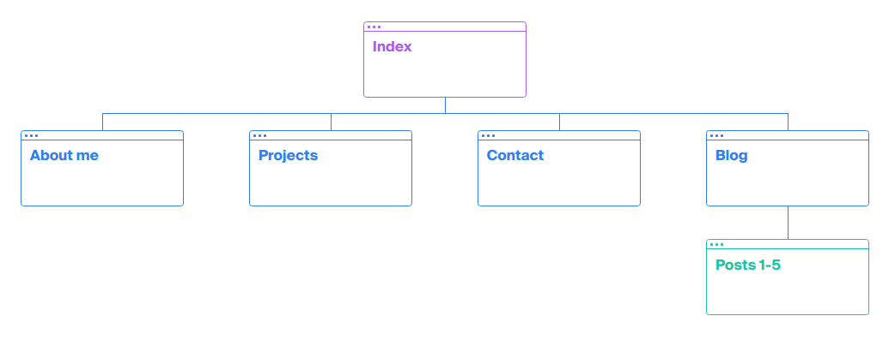

# T1A2 - Portfolio - Jordan Wegener
# Readme

## URL: https://boring-newton-301006.netlify.app/

## Website Description

### Purpose

This website is intended to serve as my professional portfolio as a web developer. It's my hope that those either seeking me out to provide development services or to offer employment might use this site to find out more about me and get in contact with me.

### Functionality/features

The website features:

- A responsive navbar providing a consistent navigation experience that remains unchanged throughout the entire site
- Responsive layout which scales well to desktop, tablet or mobile screens and makes efficient use of available screen real estate
- A contact form to allow visitors to get in touch with me
- A showcase of projects I've been involved in
- A blog page with 5 post summaries which link to 5 individual full blog post pages

### Sitemap

### Screenshots

